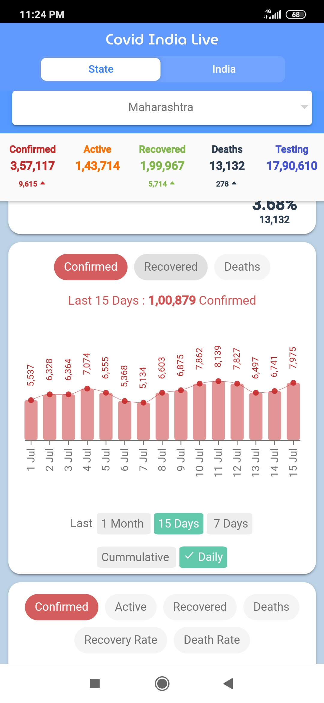

# COVID-19 India Dashboard Cross-Platform App

## Overview

This repository contains the codebase for the **COVID-19 India Dashboard Cross-Platform App**, a user-friendly application providing comprehensive COVID-19 statistics for Indian states and the entire country. The app features interactive D3 charts and maps for enhanced data visualization.
<br />

### Demo

Checkout&nbsp; [Live Demo : &nbsp;covid-india-live.firebaseapp.com ](https://covid-india-live.firebaseapp.com/)
<br /> *(Use mobile for better user experience)*

## Features

- **Cumulative/Daily View:** View cumulative and daily COVID-19 statistics.
- **Map View:** Visualize data on a map for easy understanding.
- **Sorting Options:** Sort data by various categories for better analysis.
- **Percentage-wise Statistics:** Get insights into percentage-wise statistics for informed decision-making.

<br />


## Contents

- [Overview](#overview)
- [Demo](#demo)
- [Features](#features)
- [Technologies Used](#technologies-used)
- [Demo Video](#demo-video)
- [Data Source](#data-source)
- [Platforms Supported](#platforms-supported)
- [Installation](#installation)
- [Deployment](#deployment)
- [Contributing](#contributing)
- [Screenshots](#screenshots)


## Technologies Used

- Ionic Framework (cross-platform framework).
- Angular 
- D3.js (creating interactive data visualizations).
- Firebase Platform for web hosting.


## Demo Video


https://github.com/SameerKhurd/Covid-India-Live/assets/16721546/90d70046-c144-49b4-9088-d6800795ff83


## Data Source

Data sourced from [Covid19india.org](https://www.covid19india.org/).

## Platforms Supported

- **iOS**
- **Android**
- **Progressive Web App (PWA)**

## Installation

1. Clone the repository:
   ```sh
   git clone https://github.com/SameerKhurd/Covid-India-Live.git
   ```
2. Navigate to the project directory:
   ```sh
   cd Covid-India-Live
   ``` 
3. Install dependencies:
   ```sh
   npm install
   ```

### Running Locally

4. Start the server:

   ```sh
   npm start
   ```

   or

   ```sh
   ionic serve
   ```
## Deployment


1. Configure GitHub Actions to build and deploy to Firebase Hosting on commits to the deploy branch.
2. GitHub Actions runners will build the package and deploy it automatically.


## Contributing

1. Fork the repository.
2. Create a new branch (`git checkout -b feature-branch`).
3. Make your changes and commit them (`git commit -m 'Add new feature'`).
4. Push to the branch (`git push origin feature-branch`).
5. Open a pull request

## Screenshots

- State Landing Screen
  

- Country Map Visulization
  

- State Daily Stats
  

- Country Table
  

    [More Screenshots & Demo Video](./screenshots/)
